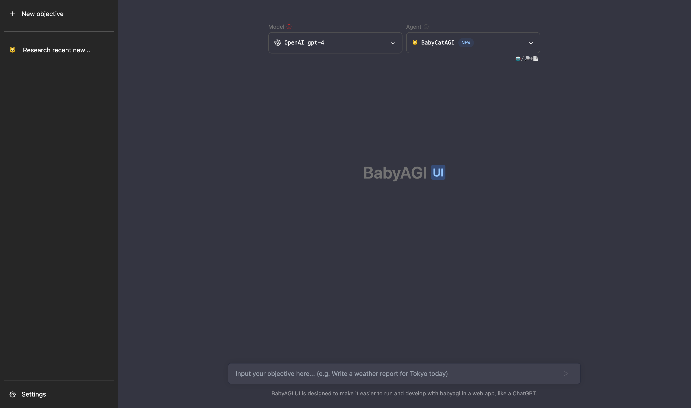

# 🤖🖥️ WebAGI

BabyAGI UI is designed to make it easier to run and develop with [babyagi](https://github.com/yoheinakajima/babyagi) in a web app, like a ChatGPT.
This is a port of [babyagi](https://github.com/yoheinakajima/babyagi) with [Langchain.js](https://github.com/hwchase17/langchainjs) and build a user interface.



## 🧰 Stack

- [Next.js](https://nextjs.org/)
- [Pinecone](https://www.pinecone.io/)
- [LangChain.js](https://github.com/hwchase17/langchainjs)
- [Tailwind CSS](https://tailwindcss.com/)
- [Radix UI](https://www.radix-ui.com/)

## 👉 Getting Started

1. Clone the repository

```sh
git clone https://github.com/miurla/babyagi-ui
```

2. Go to the project holder

```sh
cd babyagi-ui
```

3. Install packages with npm

```sh
npm install
```

4. Setup your .env file. And set the variables.
   - You need to create an index in advance with [Pinecone](https://www.pinecone.io/).
     - [Reference setting](./public/pinecone-setup.png)
   - Set your SerpAPI Key, if you want to use the search tool with BabyBeeAGI.

```sh
cp .env.example .env
```

5. Run the project

```sh
npm run dev
```
